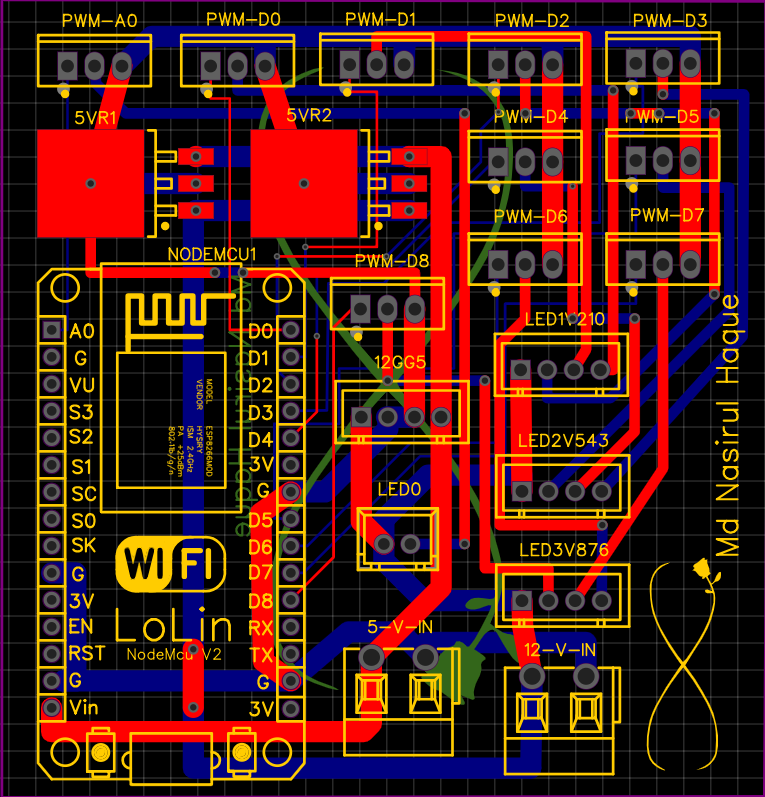
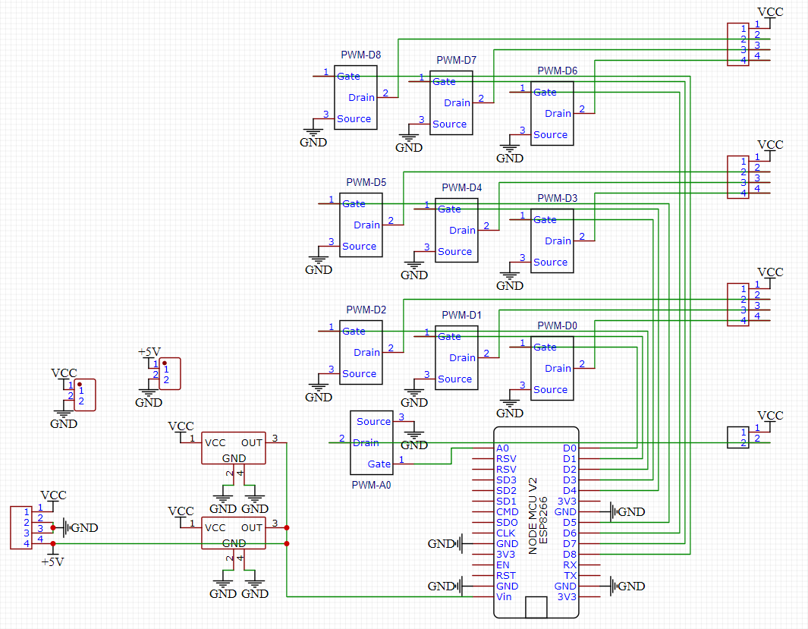

# Smart Bedroom
Smart room with NodeMCU along with Google Assistant and Alexa integration using free software which can add up to 8 devices for free.

 

    

## Note
> * Use the latest **[ESP Arduino Core](https://github.com/esp8266/Arduino)** *3.0.2*.
> * Use the latest **[WebSocktes library](https://github.com/Links2004/arduinoWebSockets)** *2.3.5*.
> * Use **Sinric Pro** if you want only **3 devices**.
> * Use **SmartNest** if you want to use **5 devices**.
> * You can use paid version for any or both of the above softwares if you want more devices.

---

## Hardware
Anything which can be connected to NodeMCU (If you can code it to work) and following devices out of the box: 
> * Switch
> * Dimmable Switch
> * Light
> * TV
> * Speaker
> * Thermostat
> * Fan (US and non US version)
> * Lock
> * Doorbell
> * Temperature Sensor
> * Motion Sensor
> * Contact Sensor
> * Windows Air Conditioner
> * Interior Blinds
> * Garage Door
> * Custom devices

---

## ArduinoIDE and Application Accounts
> 1. Download and Install [Arduino IDE](https://www.arduino.cc/en/software).
> 2. Open *File / Preferences* and add the link [http://arduino.esp8266.com/stable/package_esp8266com_index.json](http://arduino.esp8266.com/stable/package_esp8266com_index.json)
> 3. Open *Tools / Board / Board Manager...* and search for *ESP8266* and add the latest from ESP8266 Community.
> 4. Open Library Manager (*Tools / Manage Libraries*) and add the dependent libraries.
>> * For upto 3 devices [SinricPro](https://github.com/sinricpro/esp8266-esp32-sdk) by Sinricpro (minimum version 2.9.10).
>> * For more than 3 devices upto 8 or upto 5 devices using **SmartNest** [PubSubClient](https://github.com/knolleary/pubsubclient) by Knolleary (minimum version 2.8.0).
>> * [ArduinoJson](https://github.com/bblanchon/ArduinoJson) by Benoit Blanchon (minimum version 6.12.0).
>> * [WebSockets](https://github.com/Links2004/arduinoWebSockets) by Markus Sattler (minimum version 2.3.5).
>> *  **If not found in *Arduino IDE Library Manager* then use *Sketch / Include Library / Add .Zip Library...* to add the libraries the packages from Dependencies Folder**.
> 6. Create [Sinric Pro](https://sinric.pro/) account.
> 7. Create [SmartNest](https://www.smartnest.cz/) account.

---

## Getting Started
There are 3 examples with following configulations. The sample is for a simple on off of built-in LED light on NodeMCU:
> * [Only SinricPro]().
> * [Only SmartNest]().
> * [Both SinricPro and SmartNest]().

## Adding Device on SmartNest
> 1. Login to **SmartNest**.
> 2. Click on **All Devices**.
> 3. Click on **New Device**.
> 4. Give device name, type and group (if any).
> 5. Click on **Done**.
> 6. Click on three dots on the device card just created.
> 7. On top on the new window, in green device ID will be present, copy it for reference.
> 8. Devices can be edited, deleted using the pen icon in the above opened window.

## Addind Device on SinricPro
> 1. Login to **SinricPro**.
> 2. Click on **Devices**.
> 3. Click on **Add Device**.
> 4. Give device name, description and type leave the rest to as it is and keep on pressing **Next** and **Save** at last.
> 5. After saving the details like **Device Id**, **App Key** and **App Secret** will be shown, copy these for refrence in co>de. 
> 6. Devices can be edited, deleted from the **Devices** tab.
> 7. **App Key** and **App Secret**  will be available in **Credentials** tab.
> 8. **Device Id** will be available in the **Devices** tab.

## Google Assistant and Alexa Integration
> * On **Google Home** app or **Alexa** app link accouts created on **SinricPro** and **SmartNest**.
> * Devices added on either applications will be automatically added to the device list and can be edited for different name and rooms.

---

## Full User Documentations
Visit respective websites for full user documentations:
> * [ESP8266 Core](https://github.com/esp8266/Arduino) by ESP8266.
> * [SinricPro](https://github.com/sinricpro/esp8266-esp32-sdk) by Sinricpro.
> * [SmartNest](https://github.com/aososam/Smartnest) by Aososam.
> * [PubSubClient](https://github.com/knolleary/pubsubclient) by Knolleary.
> * [ArduinoJson](https://github.com/bblanchon/ArduinoJson) by Benoit Blanchon.
> * [WebSockets](https://github.com/Links2004/arduinoWebSockets) by Markus Sattler.

---

## Examples by Authors
> * See [SinricPro Examples](https://github.com/sinricpro/esp8266-esp32-sdk/tree/master/examples) on GitHub.
> * See [SmartNest Examples](https://github.com/aososam/Smartnest/tree/master/Tutorials/Blink) on GitHub.

---

## Components List
> * 1 unit of NodeMCU
> * 2 units of LM7805S/TR 5V Regulator (SMD DPAK package)
> * min 3, max 10 units (3 per RGB LED and 1 for single color LED) of n channel logic level power mosfet with low level gate trigger (preferabaly below 3V), example as follows:
>> * AOD4184A / D4184 : 40V 50A
>> * FR120N : 100v 9A
>> * LR7843 : 30V 161A
>> * P105n3LL : 30V 150A
> * 4 units of 4 pin JST connector
> * 1 unit of 2 pin JST connector
> * 2 units of 2 pin screw terminals
> * max 3 units of 12V +RGB LED strips (5050 led strip with 4 connections)
> * max 1 unit of 12V warm white or cool white or any single color led strip (with 2 connections)
> * 1 unit of power adapter with minimun of 12V 2A power output (amperage will increase with increase in number of LED strips, max cap will be based on power mosfet)

---

## Gerber File for PCB Fabrication
> * PCB:
>  
> * Schematic:
>  
